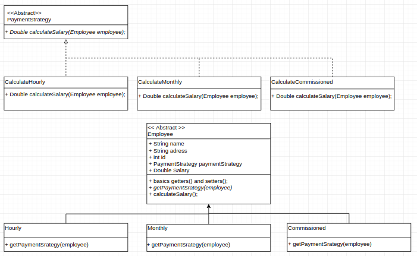
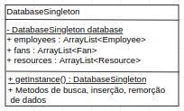

# Design Patterns / AB2

## *Functionalities*
- [x] Strategy
- [x] Singleton

## UML Strategy in payrollSystem



## *Motivation*

```
Existia no projeto três tipos de empregados salario fixo, por hora e comissionado, portanto três formas ou "estratégias"
de calcular o salário do empregado, com isso as subclasses empregados eram similares e difereriam apenas na maneira como elas executam o comportamento do calculo de salário.
```

## *Explanation*

```
Basicamente, temos a classe abstrata PaymentStrategy que geras as estratégias de calculo do salário, além disso temos uma
instancia de paymentStrategy para obter a estratégia de calculo e no decorrer do sistema temos uma função que chama 
essa instancia de estratégia para realizar o calculo com as informações necessárias.
```
## *Obs*

```
Na classe PaymentStrategy é uma interface não uma classe abstrata. 
```

## UML Strategy in Isoccer



## *Motivation*

```
Ter uma instancia da classe database que poderia ser acessada em todo o código sem precisar ficar passando como parametro
através dos métodos que representam o fluxo do sistema e executam operações com a instancia Database.
```

## *Explanation*

```
Basicamente temos uma instancia privada estática de DatabaseSingleton em sua própria classe e temos um método
para obter essa instancia, caso esse método ainda não tenha sido chamado e por isso a instancia DatabaseSingleton é nula
o método cria uma instancia nova e retona para o pedaço de código que fez sua requisição, e caso esse método já tenha
sido chamado o método apenas retorna a instancia que já foi criada outrora.
```
